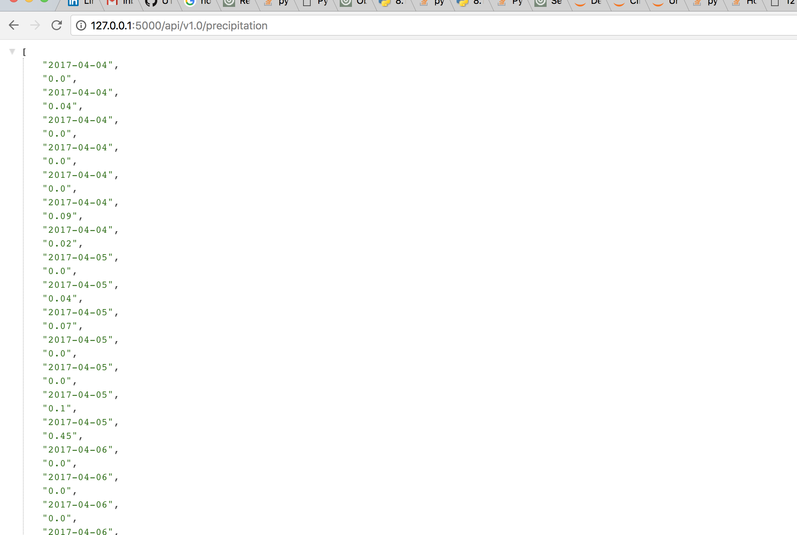
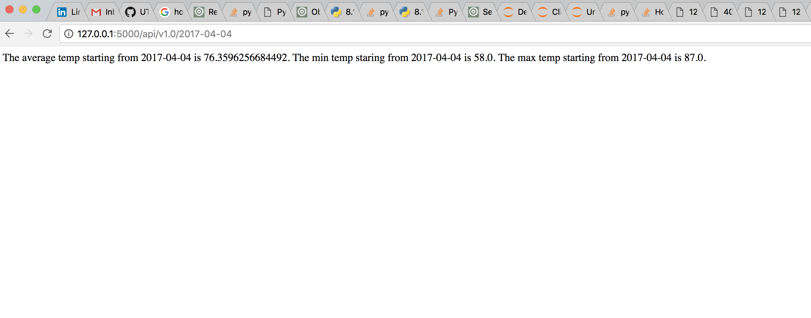
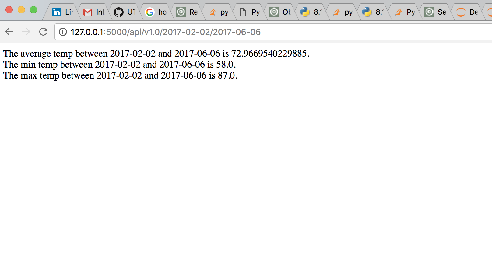

#This is md for Flask_API 
#I took a screenshot when I tested to reach each endpoint and all screenshots are linked here

```python
#################################################
# Setup engine and ORM
#################################################
#import dependencies
import datetime as dt
import numpy as np
import pandas as pd

import sqlalchemy
from sqlalchemy.ext.automap import automap_base
from sqlalchemy.orm import Session
from sqlalchemy import create_engine, func
import datetime as dt
from flask import Flask, jsonify
#connect to hawaii.sqlite 
engine = create_engine("sqlite:///output/hawaii.sqlite", echo=False)
#use automap base
# Reflect Database into ORM classes 
Base = automap_base()
Base.prepare(engine, reflect=True)

#set up session queries
session=Session(engine)
#Map measurement to an object termed ME
ME=Base.classes.measurement
#Map station to an object termed ST
ST=Base.classes.station

#################################################
# Flask Setup
#################################################

#set up today and a year ago's date
today=dt.date.today()
year_ago=today.replace(year=today.year-1)

#set up app
app = Flask(__name__)

#set up welcome page
@app.route("/")
def welcome():
    """List all available api routes."""
    return (
        f"Available Routes:<br/>"
        f"/api/v1.0/precipitation<br/>"
        f"/api/v1.0/stations<br/>"
        f"/api/v1.0/tobs<br/>"
        f"The last two please at the date you woule like to search in yyyy-mm-dd format after /<br/>"
        f"e.g. search for temps for all dates after a date /api/v1.0/2017-02-02<br/>"
        f"e.g. search for temps for dates between /api/v1.0/2017-02-02/2017-04-04<br/>"
        f"/api/v1.0/<start><br/>"
        f"/api/v1.0/<start>/<end><br/>"
    )
```


```python
#url for precipitation
@app.route('/api/v1.0/precipitation')
def precipitation():
    #get the precipitation of each day between last year today and today and order by date
    prcp_last_year=session.query(ME.date,ME.prcp).\
                    filter((ME.date>year_ago)&(ME.date<=today)).\
                    order_by(ME.date).all()
    dic=list(np.ravel(prcp_last_year))
    
    return jsonify(dic)
```


```python
#set up stations
@app.route('/api/v1.0/stations')
def stations():
    stations=session.query(func.distinct(ME.station)).all()
    stations_list=list(np.ravel(stations))
    return jsonify(stations_list)
```


```python
#set up tobs url
@app.route("/api/v1.0/tobs")
def tobs():
    tobs=session.query(ME.date,ME.tobs).filter((ME.date>year_ago)&(ME.date<=today)).order_by(ME.date).all()
    tobs_list=list(np.ravel(tobs))
    return jsonify(tobs_list)
```


```python
#set up start search
@app.route("/api/v1.0/<start>")
def start(start):
    print(start)
    start_date=dt.datetime.strptime(start, '%Y-%m-%d').date()
    print(start_date)
    ave_tobs=session.query(func.avg(ME.tobs)).filter(ME.date>=start_date).all()[0][0]
    min_tobs=session.query(func.min(ME.tobs)).filter(ME.date>=start_date).all()[0][0]
    max_tobs=session.query(func.max(ME.tobs)).filter(ME.date>=start_date).all()[0][0]
    print(ave_tobs,min_tobs,max_tobs)
    return "The average temp starting from {} is {}.\n \
            The min temp staring from {} is {}.\n \
            The max temp starting from {} is {}.".format(start,ave_tobs,start,min_tobs,start,max_tobs)
```


```python
#set up start and end search
@app.route("/api/v1.0/<start>/<end>")
def between(start,end):
    start_date=dt.datetime.strptime(start, '%Y-%m-%d').date()
    end_date=dt.datetime.strptime(end, '%Y-%m-%d').date()
    ave_tobs=session.query(func.avg(ME.tobs)).filter((ME.date>=start_date)&(ME.date<=end_date)).all()[0][0]
    min_tobs=session.query(func.min(ME.tobs)).filter((ME.date>=start_date)&(ME.date<=end_date)).all()[0][0]
    max_tobs=session.query(func.max(ME.tobs)).filter((ME.date>=start_date)&(ME.date<=end_date)).all()[0][0]
    print(ave_tobs,min_tobs,max_tobs)
    return "The average temp between {}  and {} is {}.<br/> \
            The min temp between {}  and {} is {}.<br/> \
            The max temp between {}  and {} is {}.".\
            format(start,end,ave_tobs,start,end,min_tobs,start,end,max_tobs)
```


#write code on how it run
```python
if __name__ == '__main__':
    app.run(debug=True)
```


